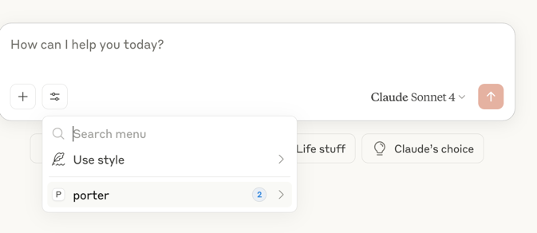

# PorterMCP Server

MCP server for Porter, that can be integrated with any MCP client or used in Any AI Agent to interact with Porter's services.

It exposes STD I/O as well as SSE endpoints so that it can be integrated with any client that supports MCP.

## Local Setup

### Prerequisites
- Java 17 or higher
- Create an account on [LocationsIQ](https://locationiq.com/) and generate an API Key (this is used for geocoding)
- Get the PFE API Key from Porter (this is used to fetch quotes)

### Testing the server
- Set the environment variables `LOCATION_IQ_API_KEY` and `PFE_API_KEY` with your respective API keys.
- Run the [test.kt](./src/main/kotlin/in/porter/mcp/server/app/test.kt) to make sure the server is able to call on these tools.

### Configuring Claude Desktop

- Clone this project and build it by running `./gradlew clean build`
- This will generate a fat jar in `build/libs/PorterMCP-1.0-SNAPSHOT-all.jar`
- In your local Claude Desktop, add the following to your `claude_desktop_config.json` file:

```json
{
  "mcpServers": {
    "porter": {
      "command": "java",
      "args": [
        "-jar",
        "/path/to/PorterMCP-1.0-SNAPSHOT-all.jar"
      ],
      "env": {
        "LOCATION_IQ_API_KEY": "xxxxx",
        "PFE_API_KEY": "xxxxx"
      }
    }
  }
}
```
- Restart the claude desktop app and tools should be visible
- 
---

## Tools Exposed

- `get_quote`
- `get_lat_lon`

### Get Lat Lon

The server exposes a `get_lat_lon` tool that can be used to fetch the latitude and longitude coordinates for a given location. This is useful for determining the pickup and drop-off points for transportation services.

### Get Porter Quote

The server exposes a `get_quote` tool that can be used to fetch the quotes for various vehicles available for transportation. The tool requires the pickup and drop coordinates, as well as customer details like name and phone number.


#### Sample Prompt
```text
Get me porter quote for a 3 wheeler vehicle to transport my stuff from Kormangla to Indiranagar for myself Saumya (91-7016667671)
```

#### Response
```text
I'll help you get a Porter quote for transporting your stuff from Koramangala to Indiranagar using a 3-wheeler vehicle. Let me first get the coordinates for both locations.

Now let me get the Porter quote for your 3-wheeler vehicle transport from Koramangala to Indiranagar:

Perfect! Here's your Porter quote for a 3-wheeler vehicle transport from Koramangala to Indiranagar:

**3 Wheeler Quote:**
- **Fare:** ₹366.97 INR
- **Capacity:** 500 kg
- **Size:** 6.0ft × 5.0ft × 5.0ft
- **Customer:** Saumya
- **Phone:** +91-7016667671

The 3-wheeler should be perfect for transporting your household items between these two nearby Bangalore locations. The vehicle can handle up to 500 kg of cargo within the specified dimensions.

You can proceed to book this through the Porter app or website using these details. The fare includes the transportation service from Koramangala to Indiranagar.
```
